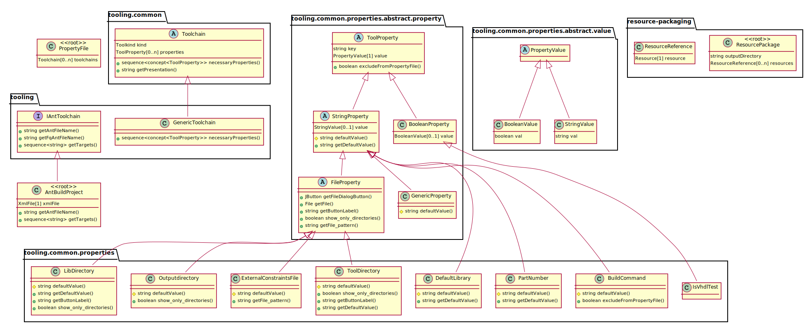

LanguageVisualization
=====================

This is an extension language for the Meta Programming System of MPS (http://www.jetbrains.com/mps). It can be used to show the structure of a language as UML class diagram.
For the visualization the PlantUML (http://plantuml.sourceforge.net) library is used. It is packed with the MPS PlantUML plugin which is shipped with the mbeddr project (http://mbeddr.com). 

This repository is a fork of https://github.com/maystar/LanguageVisualization. It was updated to support newer MPS versions.



## Installation
Builds are provided as `com.felixvollmer.langvis` in the [maven repository of this project](https://github.com/fvollmer/LanguageVisualization/packages/). The versions correspond to the MPS version (e.g. 2019.1). You also need to install `com.mbeddr.platform` which is available from the [itimis nexus](https://projects.itemis.de/nexus/#view-repositories;mbeddr~browsestorage).

## Build
Run one of the following commands:
```
./gradlew # Mac and Linux
gradlew.bat # Windows
```
All dependencies are downloaded automatically.

## Features
- Map language structure concept to UML classes
  - Visualize abstract, final and rootable attributes
- Show concept members
  - Properties
  - Children
  - References
- Show concept's behavior methods
  - Show arguments and return type
  - Viszalize abstract and static attributes
- Concepts and members are "clickable" to navigate to the source node
- Support to filter visible concepts
  - Hide concepts from other languages
  - Hide interface concepts
  - Specify a include or exclude concept list
    - subconcepts can be included/excluded, too
- Optional show UML packages for
  - languages
  - virtual packages

## Usage
Import the language `langvis` to your structure model (Ctrl + L). Add a new "language visualization node" to the structure model and name it as you like. Select the new node an choose from its conext menu "Visualize" (Ctrl + Alt + V). The mbeddr Visualization panel should be opened. You can click on elements of the UML diagram to navigate through your language.

## State
Note: This is the first shot for this language. There are lots of possibilities to improve it. Everybody is welcome to add some code or share ideas.


